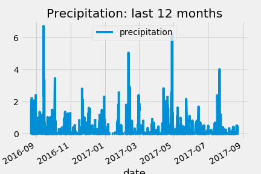

# sqlalchemy

Climate Analysis and Data Exploration of Climate Database Using Python (Pandas, Matplotlib), SQLAlchemy (ORM Queries) and Flask

Step 1 - Climate Analysis and Exploration
Use Python and SQLAlchemy to do basic climate analysis and data exploration of your climate database. All of the following analysis should be completed using SQLAlchemy ORM Queries, Pandas, and Matplotlib.

Precipitation Analysis
Design a Query to Retrieve the Last 12 Months of Precipitation Data Selecting Only the date and prcp Values
Save the Query Results as a Pandas DataFrame and Set the Index to the Date Column & Sort the Dataframe Values by date
Use Pandas Plotting with Matplotlib to plot the Data
Use Pandas to Calculate the Summary Statistics for the Precipitation Data

Station Analysis
Design a Query to Show How Many Stations are Available in the Dataset
List the Stations and Counts in Descending Order
Which Station Had the Highest Number of Observations?

Using the Station ID from the Previous Query, Calculate the Lowest Temperature Recorded, Highest Temperature Recorded, and Average Temperature of the Most Active Station

Choose the Station with the Highest Number of Temperature Observations
Design a Query to Retrieve the Last 12 Months of Temperature Observation Data for this Station
Plot the Results as a Histogram with bins=12

Step 2 - Climate App
Design a Flask API based on the queries that have been developed.

Use FLASK to create the routes
Routes
/api/v1.0/precipitation
Convert the Query Results to a Dictionary Using date as the Key and prcp as the Value
Return the JSON representation of the dictionary

Return a JSON list of stations from the dataset
Query for the dates and temperature observations from a year from the last data point
Return a JSON list of Temperature Observations (tobs) for the previous year

Return a JSON list of the minimum temperature, the average temperature and the max temperature for a given start or start-end range
When given the start only, calculate TMIN, TAVG, and TMAX for all dates greater than and equal to the start date
When given the start and the end date, calculate the TMIN, TAVG, and TMAX for dates between the start and end date inclusive
